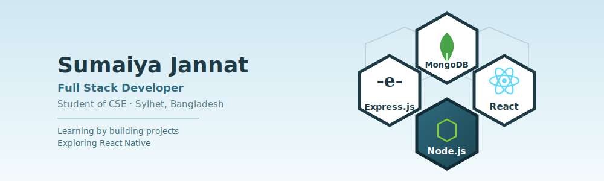

<h3 align="center">Hi! I'm Sumaiya Jannat</h3>
<h4 align="center">Full Stack Developer (MERN)</h4>

  

---

I'm a university student and full-stack developer from Bangladesh, passionate about building real-world web and mobile applications. I work across the entire stack — from designing responsive UIs to building secure APIs and integrating payments, auth, and real-time features. I love turning ideas into polished, production-ready products.

- 🚀 Exploring **Next.js 15** (App Router) for modern full-stack web apps
- 🌍 Working on a **tourism website** project
- 💳 Building **MediCare Connect** — a role-based healthcare platform with Stripe payments
- 📚 Sharpening my skills through a job-placement-focused programming course
- 🌱 Learning better DevOps practices for deploying Node.js/Express apps

---

### 🛠️ Skills

**Frontend**

**Backend**

**Mobile**

**Tools & Others**

---

### 🔗 Connect With Me

  
  
  

---

### 📊 GitHub Stats

  
  

  

